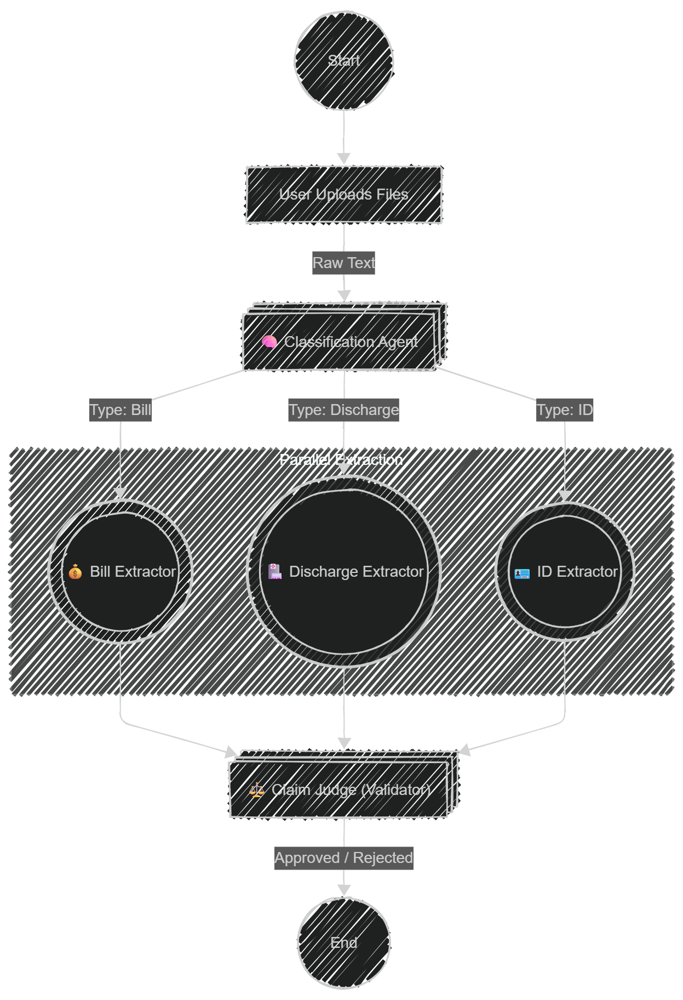
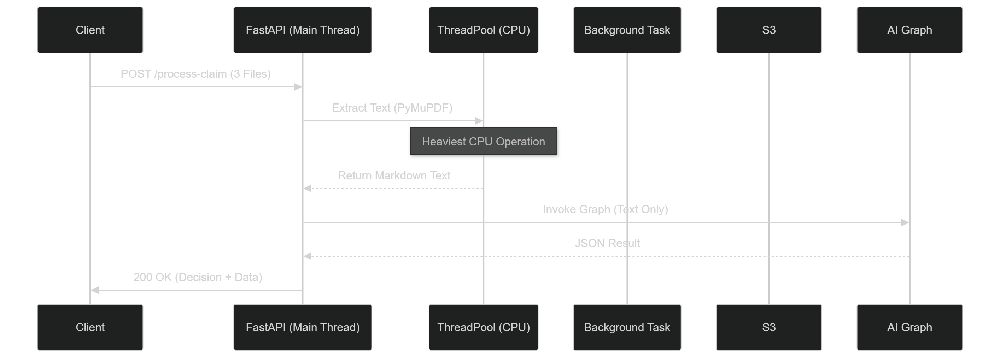
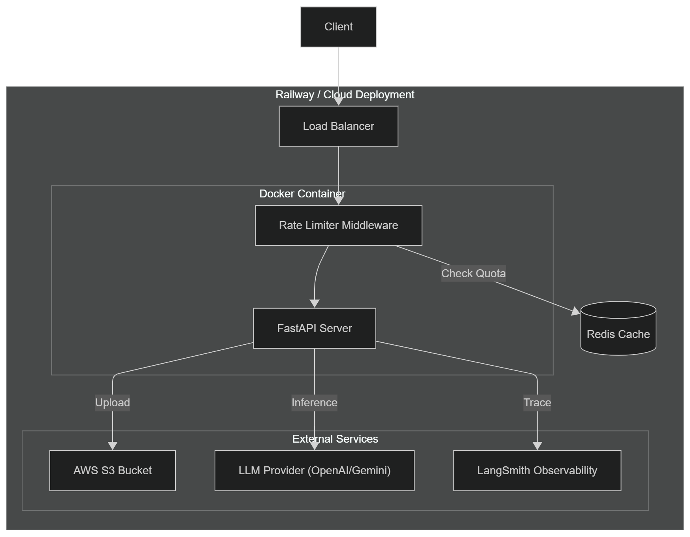

# 🏥 SureCheck AI

**SureCheck AI** is an intelligent, agentic backend for automating medical insurance claim adjudication. It ingests multiple claim documents (Bills, Discharge Summaries, IDs), extracts structured data using parallel AI agents, validates consistency across documents, and renders a final approval decision.

## 🚀 Live DemoAPI

- **Playground (Swagger UI)**: https://surecheck-ai.up.railway.app/docs
- **Documentation**: https://surecheck-ai.up.railway.app/redoc
- **Note**:
    - The demo is deployed on Railway (Free Tier). Initial cold start may take 20-30 seconds.
    - Please upload at max 5 files under 2MB each, otherwise it may crash on free tier.

> **Need files for testing❓**<br/>
Don't worry, I've got you covered, 3 sets of sample files are present in
`/public/samples` directory.

## Architecture & Design

**SureCheck AI** uses a "Smart Monolith" architecture designed to handle CPU-intensive AI tasks within constrained environments (like free-tier cloud providers) without blocking the main event loop.

### 1. The Agent Workflow (The "Diamond" Pattern):

We utilize LangGraph to orchestrate a Map-Reduce flow. A Classifier node routes documents to specialist agents, running in parallel for maximum efficiency, before aggregating results for the final Judge.



### 2. Request Processing Strategy:

To prevent timeouts and OOM (Out of Memory) errors on limited hardware, we separate concerns immediately upon request receipt:
  - I/O Bound (S3 Uploads): Offloaded to Background Tasks. The user does not wait for S3.
  - CPU Bound (PDF Extraction): Offloaded to a ThreadPool. This keeps the Async Event Loop alive for health checks.
  - Memory Management: Strict garbage collection (gc.collect()) after processing every file.



### 3. System Architecture

SureCheck AI adopts a modular smart-monolith architecture.

- The API layer rapidly offloads heavy tasks to a combination of async background workers (for I/O) and thread pools (for CPU tasks), keeping the system fast and stable even under resource limits.
- Each unit of work is passed through specialized AI agents before aggregation, while files are handled in-memory for speed and asynchronously backed up to cloud storage.
- Robust caching and rate limiting ensure efficient, secure multi-user operation.



## ✨ Key Features

1. **👁️ AI Vision Fallback (Self-Healing)**:

   - Standard extractors fail on scanned PDFs (images).
   - SureCheck AI detects when text extraction yields empty results and automatically switches to a Vision LLM (Gemini 2.5 Flash) to perform OCR on the fly.

   - Result: It reads documents that other parsers reject.

2. **🛡️ Rate Limiting & Security**:

   - Redis-backed Rate Limiting: Limits requests (5/min) per IP to prevent LLM cost spikes.
   - Validations: Strict checks on file types, sizes, and structure before processing.

3. **☁️ Hybrid Cloud Storage**:

   - Files are processed in-memory for speed (Zero-Disk Architecture).
   - Files are asynchronously backed up to AWS S3 for audit trails.

## 🛠️ Tech Stack

  - **Language**: Python 3.12
  - **Framework**: FastAPI (Async)
  - **AI Orchestration**: LangGraph, LangChain
  - **LLMs**: OpenAI GPT-4o / Google Gemini 2.5 Pro
  - **PDF Engine**: PyMuPDF (fitz) + PyMuPDF4LLM (Markdown preservation)
  - **Infrastructure**: Docker, Docker Compose
  - **Caching**: Redis
  - **Observability**: LangSmith

## 🧪 Testing Scenarios

You can verify the logic by uploading 3 PDFs (Bill, Discharge Summary, ID) to the /process-claim endpoint.

| Scenario | Files | Expected Result | Reason |
|:---|:---|:---|:---|
| A. Happy Path | Consistent Names & Dates | Approved | All data matches. |
| B. Mismatch | "Jane Smith" vs "Janet Smythe" | Manual Review | Name discrepancy detected. |
| C. Logic Error | Bill Date before Admission | Manual Review | Temporal logic failure. |
| D. Missing Doc | No Discharge Summary | Rejected | Mandatory document missing. |

## 💻 Local Setup

### Prerequisites

  - Docker & Docker Compose
  - Python 3.12+ (if running locally without Docker)
  - Poetry (Package Manager)

### Getting Started

**1. Clone Project**:
```bash
git clone https://github.com/imtiaj-007/surecheck-ai.git
cd surecheck-ai
```

**2. Setup Enviornment Variables**:
```bash
cp .env.example .env.development
```

> Sample env variables

```bash
APP_ENV=development

# AWS Credentials
AWS_ACCESS_KEY=your_access_key
AWS_SECRET_ACCESS_KEY=your_secret_access_key
AWS_REGION=preferred_aws_region
AWS_BUCKET_NAME=your_bucket_name

# LLM Credentials
OPENAI_API_KEY=your_openai_api_key
OPENAI_MODEL=gpt-5
GEMINI_API_KEY=your_gemini_api_key
GEMINI_MODEL=gemini-2.5-pro

LOG_LEVEL=debug
```
> Note: Please check `.env.example` for actual variables.


**3. Run with Docker (Recommended)**:
```bash
# Build the application
docker-compose build

# Run the application
docker-compose up

# Build and run the application in one go
docker-compose up --build

# For running the application in detached mode
docker-compose up -d

# Remove & clean up the container
docker-compose down -v
```

This spins up the API and a local Redis instance.
- Access the API at: http://localhost:8000/docs

**4. Run Locally (Dev)**:
```bash
# Using docker with hot-reload (Recommended)
docker-compose -f docker-compose.dev.yaml up --build

# Using Poetry
poetry install
poetry run poe dev
```

## 🤖 AI Tools Used

SureCheck AI development leveraged several state-of-the-art AI tools and platforms to boost productivity and code quality:

- **Cursor**: AI-powered code editor for rapid prototyping, refactoring, and code search.
- **Gemini 3.0 Pro**: For code explanations, documentation drafts, error troubleshooting, and architectural suggestions.
- **Anthropic Claude 4.5 Sonnet**: Used for prompt engineering, language polishing, and detailed design reviews.


## 📝 Sample Prompts Used

Some actual prompts used with AI tools in this project:

**1. Classification Prompt**:
```python
You are an expert document classifier for a Medical Insurance Claims processing system.
Your task is to analyze the provided text content of a document and classify it into exactly one of the following categories:

1. **bill**: A medical invoice, hospital bill, pharmacy receipt, or payment breakdown. Contains financial amounts, tax details, or line items.
2. **discharge_summary**: A clinical report detailing a patient's stay, diagnosis, treatment, and discharge instructions. Written by medical professionals.
3. **id_card**: An insurance policy card, government ID (passport/license), or employee ID. Contains photos (described in text) or compact identity details.
4. **pharmacy_bill**: Specifically a bill for medicines/drugs. (If uncertain, classify as 'bill').
5. **claim_form**: A standardized form (like CMS-1500) filled out to request reimbursement.
6. **other**: Any document that does not strictly fit the above categories (e.g., emails, handwritten notes, unknown formats).

**Instructions:**
- Analyze the text structure, keywords, and headers.
- 'Bill' usually contains keywords like "Total", "Amount", "GST", "Invoice".
- 'Discharge Summary' usually contains "Diagnosis", "History", "Admission Date", "Course in Hospital".

**Input Format:** Markdown text.
**Output Format:** Strict JSON matching the schema.
```

**2. Bill Extraction Prompt**:
```python
You are an expert Medical Bill Extractor.
Your goal is to extract structured financial data from the provided medical invoice or pharmacy receipt.

**Extraction Rules:**
1. **Invoice Number**: Look for "Inv No", "Bill No", "Receipt #". If multiple exist, prefer the one near the date.
2. **Hospital/Pharmacy Name**: Usually at the top center/left. Ignore logos if represented as text.
3. **Bill Date**: Format as YYYY-MM-DD. If multiple dates (admission/discharge/bill), prefer the 'Bill Date' or 'Invoice Date'.
4. **Total Amount**: The final amount to be paid (Grand Total).
   - IGNORE 'Subtotal' or 'Net Amount' if a 'Grand Total' exists.
   - Look for the largest monetary value at the bottom.
5. **Currency**: Infer from symbols ($, ₹, €, £). Default to "USD" if unclear, or "INR" if Indian context is detected.

**Input Format:** Markdown text (tables preserved).
**Output Format:** Strict JSON matching the schema.
```

> For all prompts please check [src/ai/prompts.py](src/ai/prompts.py) file.

## 💬 Example Request + Response (API Playground)

**Request (to `/process-claim`):**
```json
POST /process-claim
{
  "files": [
    "Bill.pdf",
    "DischargeSummary.pdf",
    "ID.pdf"
  ]
}
```

**Response (Scenario A: Approved):**
```json
{
  "documents": [
    "Bill.pdf",
    "DischargeSummary.pdf",
    "ID_Card.pdf"
  ],
  "validation": {
    "missing_documents": [],
    "discrepancies": [],
    "validation_timestamp": "2025-11-30T10:30:00Z"
  },
  "claim_decision": {
    "status": "approved",
    "reason": "All mandatory documents are present and data is consistent across files.",
    "adjudicator": "SureCheck AI Agent",
    "notes": null,
    "explanation": "Patient name 'John Doe' matches on ID and Bill. Service dates fall within the valid admission period."
  }
}
```

**Response (Scenario B: Manual Review):**
```json
{
  "documents": [
    "Bill.pdf",
    "DischargeSummary.pdf",
    "ID_Card.pdf"
  ],
  "validation": {
    "missing_documents": [],
    "discrepancies": [
      {
        "severity": "critical",
        "message": "Name mismatch: Bill says 'Jane Smith', ID says 'Janet Smythe'",
        "field": "patient_name",
        "doc_type": "id_card"
      },
      {
        "severity": "warning",
        "message": "Bill Date (2025-02-01) is before Admission Date (2025-02-05)",
        "field": "bill_date",
        "doc_type": "bill"
      }
    ],
    "validation_timestamp": "2025-11-30T10:35:00Z"
  },
  "claim_decision": {
    "status": "manual_review",
    "reason": "Critical discrepancies detected in patient identity and service dates.",
    "adjudicator": "SureCheck AI Agent",
    "notes": "Flagged for human auditor review.",
    "explanation": null
  }
}
```

## ⚠️ Notes on Limitations and Failures

- **Model Hallucination:** LLMs may occasionally infer or hallucinate details that are not present in the provided document, particularly with poor-quality scanned PDFs or handwriting.
- **Ambiguous Documents:** Documents that deviate significantly from expected formats, or that combine multiple document types (e.g., a bill stapled to a handwritten note), may result in partial or failed extractions and trigger a `manual_review` or `rejected` status.
- **Inconsistent Field Names:** Extraction performance can drop if field labels and document layouts are very non-standard or missing expected keywords.
- **Non-Textual Content:** Critical information present only in images, handwriting, or stamps may not be extracted reliably, as the AI focuses on recognized and structured text.
- **Schema Strictness:** Returned results strictly follow the defined extraction schema; unexpected content or document edge cases may be omitted from outputs.

If you encounter extraction issues or suspect an error, please check the logs for details or open an issue!


## 📁 Project Structure

```bash
surecheck-ai
├── src
│   ├── main.py                  # Application entrypoint
│   ├── api/                     # FastAPI routes
│   ├── core/                    # App configuration, Redis & AWS settings
│   ├── ai/
│   │   ├── agent/               # Individual AI agents (e.g., Bill, Classifier)
│   │   ├── graph/               # LangGraph state & workflow logic
│   │   └── prompts.py           # Centralized prompt repository
│   ├── schema/                  # Pydantic DTOs for request, response and states
│   ├── service/                 # S3 interactions & service logic
│   └── utils/                   # Utilities: PDF loader, logger, rate limiter
├── tests/                       # Unit and integration tests
├── .env.example                 # Sample environment variables
├── .gitignore                   # Git ignore rules
├── Dockerfile                   # Multi-stage build (Debian Slim)
├── docker-compose.yaml          # Docker Compose stack definition
├── docker-compose.dev.yaml      # Docker Compose for development (hot-reload, etc.)
├── pyproject.toml               # Python dependencies and project metadata
├── README.md                    # Project documentation
└── LICENSE                      # MIT License
```

**Key Folders:**
- `src/ai/`: AI agents, workflow logic, and prompts.
- `src/api/`: All API route definitions using FastAPI.
- `src/core/`: Application configuration and core service settings.
- `src/service/`: External service integrations (e.g., S3).
- `src/utils/`: Helper modules such as PDF parsing, logging, and rate limiting.

**Other Files:**
- `Dockerfile`, `docker-compose.yaml`: Containerization and stack setup.
- `pyproject.toml`: Dependency and project information.

## 📜 License

This project is licensed under the MIT License.
See the [LICENSE](./LICENSE) file for details.

---

## 🙏 Credits & Acknowledgements

This project is built using the following amazing open-source tools and services:

- [FastAPI](https://fastapi.tiangolo.com/) — Modern, fast (high-performance) web framework for building APIs with Python.
- [Pydantic](https://docs.pydantic.dev/) — Data validation and settings management using Python type annotations.
- [LangChain](https://www.langchain.com/) — Toolkit for developing applications powered by large language models (LLMs).
- [LangGraph](https://www.langchain.com/langgraph) — Stateful multi-agent workflow orchestration for LLM applications.
- [OpenAI](https://openai.com/) — Provides foundational LLM and generative AI APIs.
- [Gemini](https://ai.google.dev/) — Google's generative AI model (via API) for advanced language understanding.

**Special thanks to the maintainers and communities behind these projects.**
